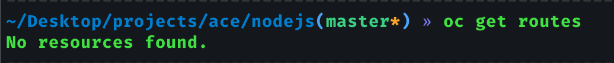

# Export Application Resources

In the previous chapter, we deploy our application in a cluster of Openshift. But we do not what happen,..
what are the settings we use to make that?

Well, in the following two chapter we will analize that. 
Before that, we need know more about the application which we deployed. 

That application have several configurations and endpoint which we will use to verify ours configurations in Openshift.

But first, I mentioned endpoint... What endpoints?!

Well, the endpoints are:

- GET /ping -> used to keep alive proobs.
- GET /password -> used to verify what is the password setted to conect whit redis service
- GET /pod -> used to verify in what pod is running the application
- GET /exceptions/top -> return all exceptions saved in redis cache. When the application starts, this make an initial load in redis using this [file](https://github.com/carlossagala/workshops/blob/master/nodejs/config/java.json)
- POST /exceptions/ -> to add a new exception to the list 
- DELETE /exceptions/:id -> to remove a exception from the list
- UPDATE /exceptions/vote/:id -> to add one to the exception counter 

To continue, we need use some endpoint. For that propuose we need the url of the app. We can get that with the command.
        
        oc get routes

That error is natural because the applications provisioned with **oc new-app**, their **Route** is not created.

We can fix that, using the command **oc expose**

    oc expose svc/workshops

Now, we can consume the application in a external way.

    curl workshops-exceptions.apps.cluster-e8fc.e8fc.sandbox1648.opentlc.com/ping -s

    curl workshops-exceptions.apps.cluster-e8fc.e8fc.sandbox1648.opentlc.com/pod -s

    curl workshops-exceptions.apps.cluster-e8fc.e8fc.sandbox1648.opentlc.com/password -s

    curl workshops-exceptions.apps.cluster-e8fc.e8fc.sandbox1648.opentlc.com/exceptions/top -s

it is a lot of information, to see it more pretty i recommend to use **"jq"** :smile:

At this point, we can know better the application. The next point is to know the Openshift resources. For that we will exec the followings commands:

    oc get bc -lapp=workshops -o yaml > bc.yml
    oc get is -lapp=workshops -o yaml > is.yml
    oc get dc -lapp=workshops -o yaml > dc.yml
    oc get svc -lapp=workshops -o yaml > svc.yml
    oc get route -lapp=workshops -o yaml > route.yml
    

This commands generated five files. This files contains the next information:

- dc: is the abbreviation of **DeploymentConfig (DC)**. The DC contain all configuration about the deploy of Container Image.
- is: is the abbreviation of **ImageStream (IS)**. This resource will be explained in the chapter 02.
- bc: is the abbreviation of **BuildConfig (BC)**. This BC 
contains all the settings to carry out the compilation of the new Image.
- svc: is the abbreviation of **BuildConfig (SVC)**. 
This resource fulfills the function of acting as a balancer for pods based on their configuration.
- route: This resource fulfills the function of acting as a point to consume the SVC provisioned in the plataform.
 
The yamls obtained should look like the ones in this [folder](https://github.com/carlossagala/workshops/tree/master/nodejs/ocp/01/templates).

    
